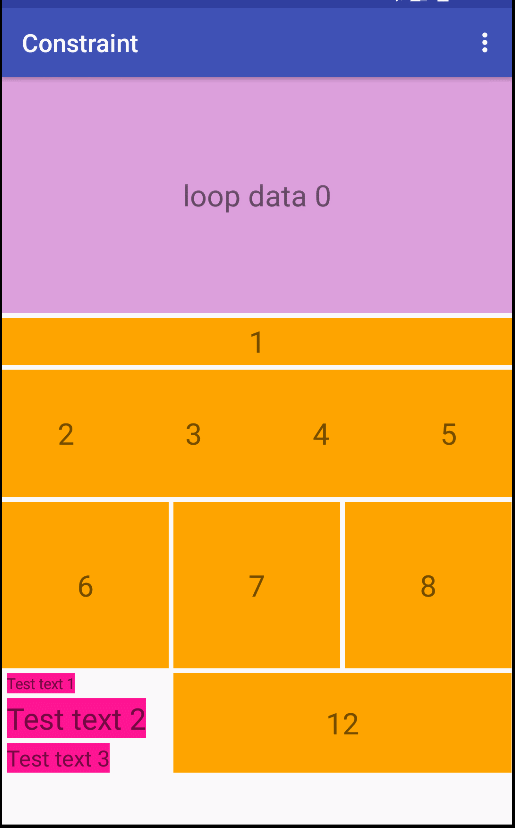
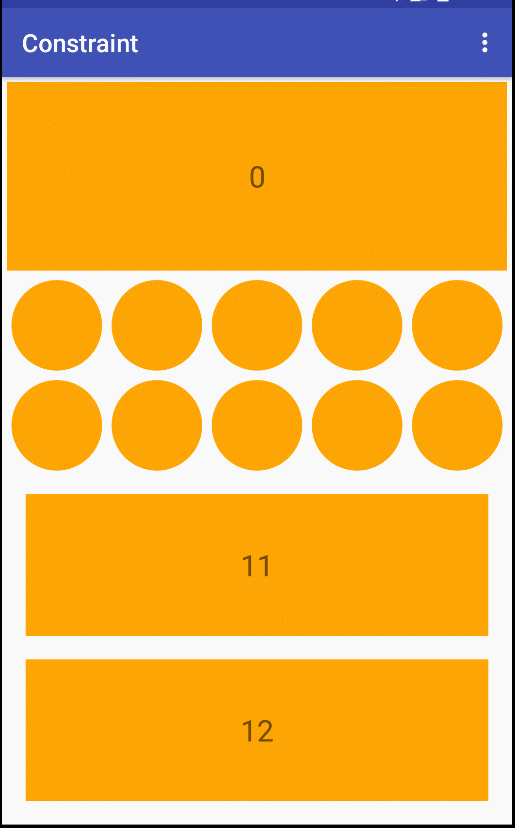
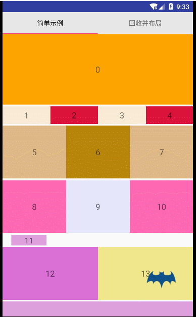
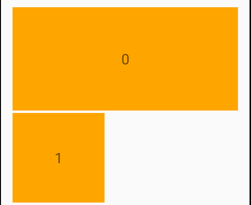
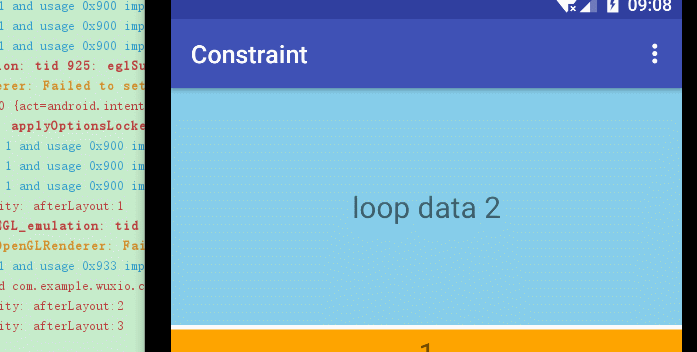
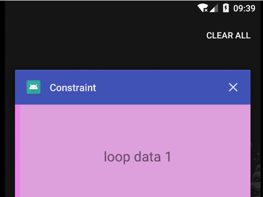
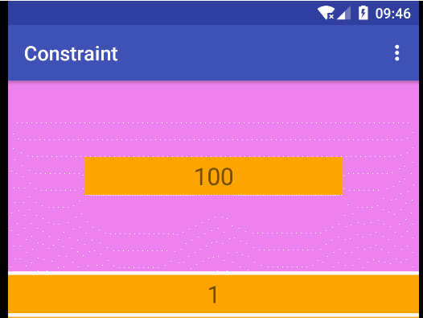

## 复杂布局实现

```
allprojects {
	repositories {
		maven { url 'https://jitpack.io' }
	}
}
```
```
dependencies {
    compile 'com.github.threekilogram:Constraint:v1.0'
}
```

## 简介

使用约束构建布局,类似[ConstraintLayout \| Android Developers](https://developer.android.com/reference/android/support/constraint/ConstraintLayout.html),使用 `adpter` 适配界面,可以简单的实现任何view之间位置相关界面,性能优越,测量之后就已经知道view的布局位置,简化布局操作,节省内存,只记录对view的操作,没有实体类保存信息.配置灵活,每次操作之前都会询问用户.

### 示例01



---



---



### 约束

[Constraint](https://github.com/threekilogram/Constraint/blob/master/constraintlayout/src/main/java/com/example/constraintlayout/Constraint.java) : 约束,用来描述描述一块儿区域,限制view位于描述的区域

* 可以相对父布局

```
constraint.leftToLeftOfParent(50) 		--> 约束自己的左边至父布局的左边,参数是偏移量,方向同android坐标系
        .rightToRightOfParent(-50)		--> 含义同上
        .topToTopOfParent(50)			--> 含义同上
        .bottomToTopOfParent(500);		--> 含义同上
```


* 可以相对已经布局好的view

```
constraint.leftToLeftOfView(0, 0)		--> 约束自己的左边至布局位置为0的view的左边,第一个参数用来参考的布局位置,第二个参数偏移量
        .topToBottomOfView(0, 10)		--> 含义同上
        .rightToLeftOfView(0, 400)		--> 含义同上
        .bottomToBottomOfView(0, 400);		--> 含义同上
```



* 亦可以混用,只要可以画出一块区域就行

```
constraint.leftToLeftOfParent(50)		--> 约束至父布局
        .topToTopOfView(0, 0)		-->约束至view
        .rightToRightOfView(0, 0)
        .bottomToTopOfView(0, 100);
```


## 需要使用一个[BaseConstraintAdapter](https://github.com/threekilogram/Constraint/blob/master/constraintlayout/src/main/java/com/example/constraintlayout/adapter/BaseConstraintAdapter.java)适配界面

```
private class SimpleAdapter extends BaseConstraintAdapter {

	//返回对布局位置的view的约束
    @Override
    public Constraint generateConstraintTo(int position, Constraint constraint) {
        switch (position) {
            case 0:
                constraint.leftToLeftOfParent(50)
                        .rightToRightOfParent(-50)
                        .topToTopOfParent(50)
                        .bottomToTopOfParent(500);
                break;
            case 1:
                constraint.leftToLeftOfView(0, 0)
                        .topToBottomOfView(0, 10)
                        .rightToLeftOfView(0, 400)
                        .bottomToBottomOfView(0, 400);
                break;
            case 2:
                constraint.leftToLeftOfParent(50)
                        .topToTopOfView(0, 0)
                        .rightToRightOfView(0, 0)
                        .bottomToTopOfView(0, 100);
                break;
            default:
                break;
        }
        return constraint;
    }

	//返回对应位置的view
    @Override
    public View generateViewTo(int position) {
        View view;
        switch (position) {
            case 2:
                view = getTextView(position, getColorC(R.color.skyblue));
                break;
            default:
                view = getTextView(position);
                break;
        }
        return view;
    }


	// 返回view的个数
    @Override
    public int getChildCount() {
        return 3;
    }
}
```

### 配置

* adapter 支持布局询问操作

```
// 布局之前回调
@Override
public void beforeLayout(int position, View view) {
    super.beforeLayout(position, view);
	// 初始化操作
}

// 布局之后回调
@Override
public void afterLayout(int position, View view) {
    super.afterLayout(position, view);

	// 设置监听,或者开始动画
}
```

* 控制界面刷新过程
	* 当子view调用 `requestLayout()` 时,父布局界面会刷新重新布局,而此布局并不需要全部刷新界面可以使用 `com.example.constraintlayout.ConstraintLayout.OnRelayoutListener`控制刷新过程



>可以看到界面在 viewPager 轮播时不断重新测量绘制

可以使用 `OnRelayoutListener`控制界面的重新测量布局过程

```
mConstraintLayout.setOnRelayoutListener(new ConstraintLayout.OnRelayoutListener() {
    @Override
    public boolean onRemeasure(ConstraintLayout layout) {
        layout.remeasureView(0);  --> 只重新测量位置为 0 的view
        return false;	--> 如果返回 true 将全部重新测量
    }
    @Override
    public boolean onRelayout(ConstraintLayout layout) {
        layout.relayoutView(0);  --> 只重新布局位置为 0 的view
        return false;	--> 如果返回 true 将全部重新布局
    }
});
```

* 更新约束

```
Constraint constraint = mConstraintLayout.obtainConstraint();
constraint.leftToLeftOfView(0, 0, 500).topToBottomOfView(0, 10, 80);
mConstraintLayout.updateConstraint(1, constraint);
```



* 临时添加/删除一个view

```
TextView view = getTextView(100);

mConstraintLayout.post(new Runnable() {
    @Override
    public void run() {
        Constraint constraint = mConstraintLayout.obtainConstraint();
        constraint.leftToLeftOfView(0, 200)
                .rightToRightOfView(0, -200)
                .topToTopOfView(0, 200, 100);
        mConstraintLayout.addExtraView(view, constraint);
    }
});

mConstraintLayout.postDelayed(new Runnable() {
    @Override
    public void run() {
        mConstraintLayout.removeExtraView(view);
    }
}, 3000);
```

