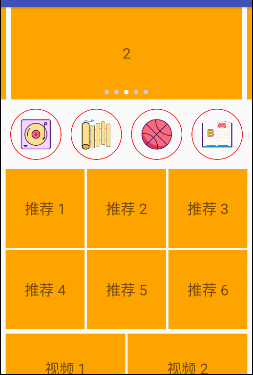

## 复杂布局实现

```
allprojects {
	repositories {
		maven { url 'https://jitpack.io' }
	}
}
```
```
dependencies {
    implementation 'com.github.threekilogram:Constraint:${version}'
}
```

[version 版本号在这里](https://github.com/threekilogram/Constraint/releases)

注意:需要 java 8 支持

```	
// app/build.gradle
compileOptions {
    sourceCompatibility JavaVersion.VERSION_1_8
    targetCompatibility JavaVersion.VERSION_1_8
}
```

## 简介

使用约束构建布局,类似[ConstraintLayout \| Android Developers](https://developer.android.com/reference/android/support/constraint/ConstraintLayout.html),

不同的是使用 `adpter` 适配界面,在测量时生成view并布局,一次测量完成传统的view测量布局两个步骤,

可以简单的实现任何view之间位置相关界面,性能优越,测量之后就已经知道view的布局位置,简化布局操作,节省内存,只记录对view的操作,没有实体类保存信息.

配置灵活,每次操作(测量/布局)之前都会询问用户.

### 可以简单的实现如下布局(也可以根据数据动态生成,即每次打开页面都不一样)

#### 首页效果 01



---

#### 首页效果 02


---

#### recycler 实现复杂布局


---

#### 混排效果(根据json数据生成界面)


#### 流式布局效果


### 约束介绍

[Constraint](https://github.com/threekilogram/Constraint/blob/master/constraintlayout/src/main/java/com/example/constraintlayout/Constraint.java) : 约束,用来描述描述一块儿区域,限制view位于此区域

* 可以相对父布局

```
constraint.leftToLeftOfParent(50) 		--> 约束自己的左边至父布局的左边,参数是偏移量,方向同android坐标系
        .rightToRightOfParent(-50)		--> 含义同上
        .topToTopOfParent(50)			--> 含义同上
        .bottomToTopOfParent(500);		--> 含义同上
```

* 可以相对已经布局好的view

```
constraint.leftToLeftOfView(0, 0)		--> 约束自己的左边至布局位置为0的view的左边,第一个参数用来参考的布局位置,第二个参数偏移量
        .topToBottomOfView(0, 10)		--> 含义同上
        .rightToLeftOfView(0, 400)		--> 含义同上
        .bottomToBottomOfView(0, 400);		--> 含义同上
```

* 亦可以混用,只要可以画出一块区域就行

```
constraint.leftToLeftOfParent(50)		--> 约束至父布局
        .topToTopOfView(0, 0)		-->约束至view
        .rightToRightOfView(0, 0)
        .bottomToTopOfView(0, 100);
```

## 使用[BaseConstraintAdapter](https://github.com/threekilogram/Constraint/blob/master/constraintlayout/src/main/java/com/example/constraintlayout/adapter/BaseConstraintAdapter.java)适配界面

```
private class SimpleAdapter extends BaseConstraintAdapter {

	//返回对布局位置的view的约束
    @Override
    public Constraint generateConstraintTo(int position, Constraint constraint) {
        switch (position) {
            case 0:
                constraint.leftToLeftOfParent(50)
                        .rightToRightOfParent(-50)
                        .topToTopOfParent(50)
                        .bottomToTopOfParent(500);
                break;
            case 1:
                constraint.leftToLeftOfView(0, 0)
                        .topToBottomOfView(0, 10)
                        .rightToLeftOfView(0, 400)
                        .bottomToBottomOfView(0, 400);
                break;
            case 2:
                constraint.leftToLeftOfParent(50)
                        .topToTopOfView(0, 0)
                        .rightToRightOfView(0, 0)
                        .bottomToTopOfView(0, 100);
                break;
            default:
                break;
        }
        return constraint;
    }

	//返回对应位置的view
    @Override
    public View generateViewTo(int position) {
        View view;
        switch (position) {
            case 2:
                view = getTextView(position, getColorC(R.color.skyblue));
                break;
            default:
                view = getTextView(position);
                break;
        }
        return view;
    }


	// 返回view的个数
    @Override
    public int getChildCount() {
        return 3;
    }
}
```

### 监听测量布局过程

* adapter 支持布局询问操作

```
// 测量之前回调
public void beforeMeasure(int position, View view) {

	// 可以用来设置view状态/数据
}

// 测量之后回调
public void afterMeasure(int position, View view) {

	
}

// 布局之前回调
@Override
public void beforeLayout(int position, View view) {
 
	// 可以用来初始化操作
}

// 布局之后回调
@Override
public void afterLayout(int position, View view) {

	// 可以用来设置监听,或者开始动画
}
```

## 更新一个view的布局约束

>效率很高,不会触发布局重新布局

```
Constraint constraint = mConstraintLayout.obtainConstraint();
constraint.leftToLeftOfView(0, 0, 500).topToBottomOfView(0, 10, 80);
mConstraintLayout.updateConstraint(1, constraint);	--> 更新
```

## 临时添加/删除一个view

>效率很高,不会触发布局重新布局

```
TextView view = getTextView(100);
```
```
Constraint constraint = mConstraintLayout.obtainConstraint();
constraint.leftToLeftOfView(0, 200)
        .rightToRightOfView(0, -200)
        .topToTopOfView(0, 200, 100);mConstraintLayout.postDelayed(new Runnable() {
mConstraintLayout.addExtraView(view, constraint);		--> 添加
```
```
mConstraintLayout.removeExtraView(view);		--> 删除
```
